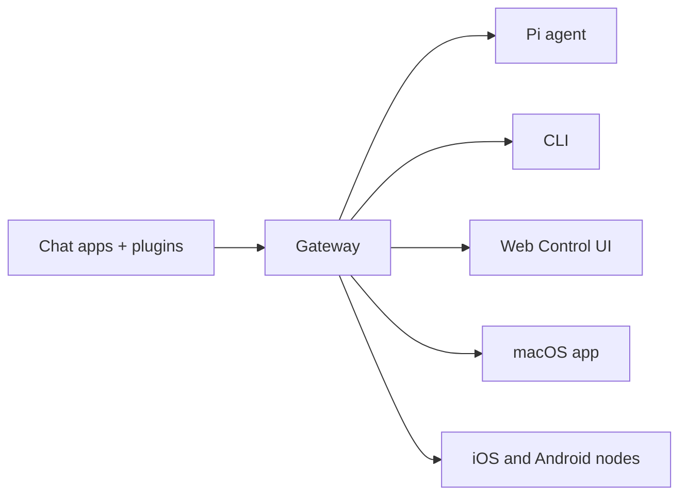

# CDog 🐶

<p align="center">
    
    
</p>

> _"EXFOLIATE! EXFOLIATE!"_ — A space lobster, probably

<p align="center">
  <strong>Any OS gateway for AI agents across WhatsApp, Telegram, Discord, iMessage, and more.</strong><br />
  Send a message, get an agent response from your pocket. Plugins add Mattermost and more.
</p>

<Columns>
  <Card title="Get Started" href="/start/getting-started" icon="rocket">
    Install CDog and bring up the Gateway in minutes.
  </Card>
  <Card title="Run the Wizard" href="/start/wizard" icon="sparkles">
    Guided setup with `cdog onboard` and pairing flows.
  </Card>
  <Card title="Open the Control UI" href="/web/control-ui" icon="layout-dashboard">
    Launch the browser dashboard for chat, config, and sessions.
  </Card>
</Columns>

## What is CDog?

CDog is a **self-hosted gateway** that connects your favorite chat apps — WhatsApp, Telegram, Discord, iMessage, and more — to AI coding agents like Pi. You run a single Gateway process on your own machine (or a server), and it becomes the bridge between your messaging apps and an always-available AI assistant.

**Who is it for?** Developers and power users who want a personal AI assistant they can message from anywhere — without giving up control of their data or relying on a hosted service.

**What makes it different?**

- **Self-hosted**: runs on your hardware, your rules
- **Multi-channel**: one Gateway serves WhatsApp, Telegram, Discord, and more simultaneously
- **Agent-native**: built for coding agents with tool use, sessions, memory, and multi-agent routing
- **Open source**: MIT licensed, community-driven

**What do you need?** Node 22+, an API key (Anthropic recommended), and 5 minutes.

## How it works



The Gateway is the single source of truth for sessions, routing, and channel connections.

## Core Features

<Columns>
  <Card title="Multi-channel Gateway" icon="network">
    Connect WhatsApp, Telegram, Discord, and iMessage through a single Gateway process.
  </Card>
  <Card title="Plugin Channels" icon="plug">
    Add more channels like Mattermost through extension packages.
  </Card>
  <Card title="Multi-agent Routing" icon="route">
    Isolate sessions by agent, workspace, or sender.
  </Card>
  <Card title="Media Support" icon="image">
    Send and receive images, audio, and documents.
  </Card>
  <Card title="Web Control UI" icon="monitor">
    Browser dashboard for chat, config, sessions, and node management.
  </Card>
  <Card title="Mobile Nodes" icon="smartphone">
    Pair iOS and Android nodes with Canvas support.
  </Card>
</Columns>

## Quick Start

<Steps>
  <Step title="Install CDog">
    ```bash
    npm install -g cdog@latest
    ```
  </Step>
  <Step title="Run the Wizard + Install Daemon">
    ```bash
    cdog onboard --install-daemon
    ```
  </Step>
  <Step title="Message Your Bot">
    Text it from WhatsApp, Telegram, or Discord!
  </Step>
</Steps>

## Architecture

The Gateway runs as a daemon and exposes:

- **WebSocket API** (`ws://127.0.0.1:18789`) for clients, tools, and events
- **REST API** (`http://127.0.0.1:18791`) for browser automation and status
- **Control UI** (`http://127.0.0.1:18793`) for web-based management

Clients connect over WebSocket and send/receive structured payloads.
The Gateway routes messages to agents, manages sessions, and coordinates tools.

## Supported Platforms

- **Desktop**: macOS, Linux, Windows
- **Mobile**: iOS (via node), Android (via node)
- **Cloud**: Docker, Fly.io, Render, Railway

## Next Steps

- [Install Guide](/start/getting-started)
- [Wizard Walkthrough](/start/wizard)
- [Configuration Reference](/config/reference)
- [Channel Setup](/channels/setup)
- [Agent Development](/agents/development)

## Community

- [Discord](https://discord.gg/clawd) — Real-time help and discussion
- [GitHub](https://github.com/openclaw/openclaw) — Source code and issues
- [Twitter/X](https://x.com/openclaw) — Announcements and updates
- [ClawHub](https://clawhub.ai) — Community skills and plugins

## License

MIT. See [`LICENSE`](https://github.com/openclaw/openclaw/blob/main/LICENSE).
